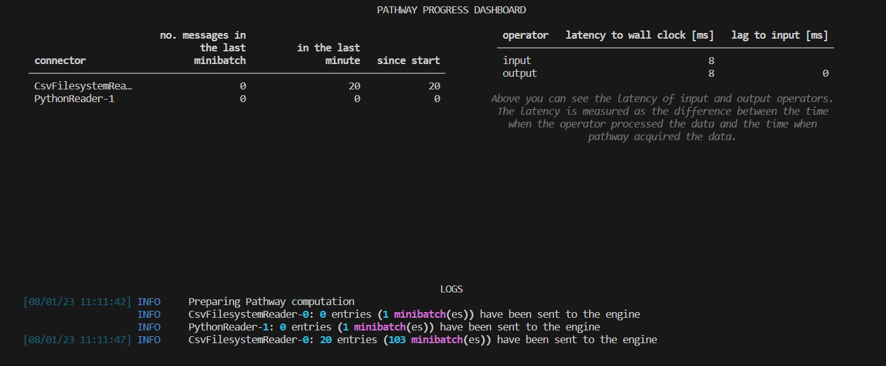

# Find discounts using LLM App

This repo demonstrates Pathway’s [LLM App features](https://github.com/pathwaycom/llm-app) with an example project that processes discount data in real-time like [Amazon Products Sales Dataset](https://www.kaggle.com/datasets/lokeshparab/amazon-products-dataset?select=Shoes.csv) as input and exposes an HTTP REST endpoint to answer user queries about current discounts from different markets in a specific location and it uses OpenAI API [Embeddings](https://platform.openai.com/docs/api-reference/embeddings) and [Chat Completion](https://platform.openai.com/docs/api-reference/completions) endpoints to generate AI assistant responses.

## Use case

[Open AI GPT](https://openai.com/gpt-4) excels at answering questions, but only on topics it remembers from its training data. If you want GPT to answer questions about unfamiliar topics such as:

- Recent events after Sep 2021.
- Your non-public documents.
- Information from past conversations.
- Real-time data.
- Including discount information.

The model might not answer such queries properly. Because it is not aware of the context or historical data or it needs additional details. In this case, you can use LLM App efficiently to give context to this search or answer process.  See how LLM App [works](https://github.com/pathwaycom/llm-app#how-it-works).

For example, a typical response you can get from the OpenAI [Chat Completion endpoint](https://platform.openai.com/docs/api-reference/chat) or [ChatGPT UI](https://chat.openai.com/) interface without context is:

```text
User: Find discounts in the USA

Assistant: Sure! Here are some ways to find discounts
in the USA :\n\n1. Coupon Websites: Websites like RetailMeNot, 
Coupons.com and Groupon offer a wide range of discounts
and coupon codes for various products and services.\n\n2.
```

As you can see, GPT responds only with suggestions on how to find discounts but it is not specific and does not provide exactly where or what kind of discount and so on.

To help the model, we give knowledge of discount information from any reliable data source (it can be JSON document, APIs, or data stream in Kafka) to get a more accurate answer. Assume that there is a `future_discounts.csv` file with the following columns of data: *discount_until, country, city, state, postal_code ,region, product_id, category, sub_category, brand, product_name, currency,actual_price ,discount_price, discount_percentage ,address*.

After we give this knowledge to GPT, look how it replies:

```text
User: Find discounts in the USA

Assistant: 

"Based on the given data, the shipment dates are as follows:
 
Discount Until: 2024-03-25  
Country: UK
City: London
Ship Mode: Standard Class
State: ON
Product ID: 9464
Postal Code: 43505
Region: East   
Category: Footwear  
Sub-category: Men's Shoes
Product: Nike Running Shoes
Actual Price: 344.58
Discounted Price: 312.65   
...
```

The app takes `future_discounts.csv` file and indexed documents into account and uses this data when processing queries. The cool part is, the app is always aware of changes in the discounts. If you add another CSV file or data source, the LLM app does magic and automatically updates the AI model's response.

## How the project works

The sample project does the following procedures to achieve the above output:

1. Prepare search data:
    1. Generate: [discounts-data-generator.py](http://discounts-data-generator.py) simulates real-time data coming from external data sources and generates/updates existing `future_discounts.csv` file with random data. In reality, you can replace it with a database, API, or message broker.
    2. Collect: The app reads the CSV file and its rows in real-time (when streaming mode is enabled) and maps each row into a structured document schema for better managing large data sets.
    3. Chunk: Documents are split into short, mostly self-contained sections to be embedded.
    4. Embed: Each section is [embedded](https://platform.openai.com/docs/guides/embeddings) with the OpenAI API and retrieve the embedded result.
    5. Indexing: Constructs an index on the generated embeddings.
2. Search (once per query)
    1. Given a user question, generate an embedding for the query from the OpenAI API.
    2. Using the embeddings, retrieve the vector index by relevance to the query
3. Ask (once per query)
    1. Insert the question and the most relevant sections into a message to GPT
    2. Return GPT's answer

## How to run the project

Example only supports Unix-like systems (such as Linux, macOS, BSD). If you are a Windows user, we highly recommend leveraging Windows Subsystem for Linux (WSL) or Dockerize the app to run as a container.

### Prerequisites

1. Make sure that [Python](https://www.python.org/downloads/) 3.10 or above installed on your machine.
2. Download and Install [Pip](https://pip.pypa.io/en/stable/installation/) to manage project packages.
3. Create an [OpenAI](https://openai.com/) account and generate a new API Key: To access the OpenAI API, you will need to create an API Key. You can do this by logging into the [OpenAI website](https://openai.com/product) and navigating to the API Key management page.

Then, follow the easy steps to install and get started using the sample app.

### Step 1: Clone the repository

This is done with the `git clone` command followed by the URL of the repository:

```bash
git clone https://github.com/Boburmirzo/find-discounts-using-llm-app.git
```

Next,  navigate to the project folder:

```bash
cd find-discounts-using-llm-app
```

### Step 2: Set environment variables

Create `.env` file in the root directory of the project and replace `{OPENAI_API_KEY}` configuration value with your key.
Optionally, you change other values.

```bash
OPENAI_API_TOKEN={OPENAI_API_KEY}
HOST=0.0.0.0
PORT=8080
EMBEDDER_LOCATOR=text-embedding-ada-002
EMBEDDING_DIMENSION=1536
MODEL_LOCATOR=gpt-3.5-turbo
MAX_TOKENS=200
TEMPERATURE=0.0
DATA_DIR=./data/
```

### Step 3: Install the app dependencies

Install the required packages:

```bash
pip install --upgrade -r requirements.txt
```

### Step 4: Run Discounts data generator (optional)

By default, the app uses the existing data in [future_discounts.csv](https://github.com/Boburmirzo/find-discounts-using-llm-app/blob/main/data/future_discounts.csv) file . You can also run the [discounts-data-generator.py](https://github.com/Boburmirzo/find-discounts-using-llm-app/blob/main/data/discounts-data-generator.py) Python script to update it. For example, you generate the second CSV file under data folder to test the app reaction on real-time data changes.  To do so:

```python
...
# Change future_discounts.csv to future_discounts2.csv
df.to_csv('./data/future_discounts2.csv', index=False)
```

```bash
cd data
python discounts-data-generator.py
```

### Step 5: Run and start to use it

You start the application by navigating to `llm_app` folder and run `main.py`:

```bash
python main.py
```

When the application runs successfully, you should see output something like this:



## Test the sample app

Assume that we have this entry on the CSV file:

| discount_until | country | city | state | postal_code | region | product_id | category | sub_category | brand | product_name | currency | actual_price | discount_price | discount_percentage | address |
| --- | --- | --- | --- | --- | --- | --- | --- | --- | --- | --- | --- | --- | --- | --- | --- |
| 2024-08-09 | USA | Los Angeles | IL | 22658 | Central | 7849 | Footwear | Men Shoes | Nike | Formal Shoes | USD | 130.67 | 117.60 | 10 | 321 Oak St |

When the user has the following query with `curl` command:

```bash
curl --data '{"user": "user", "query": "Can you find me discounts this month for Nikes men shoes?"}' http://localhost:8080/
```

You will get the response as its expected.

```text
"Based on the given data, there is one discount available this month for Nike's men shoes. Here are the details::

Discounts this week for Nike's men shoes:

City: Los Angeles
Ship Mode: Second Class
Postal Code: 22658
Category: Footwear
Sub-category: Men Shoes
Brand: Nike
Product Name: Formal Shoes
Formal Shoes
Actual Price: $130.67
Discounted Price: $117.60
Discount Percentage: 10%
Ship Date: 2024-08-09
```
